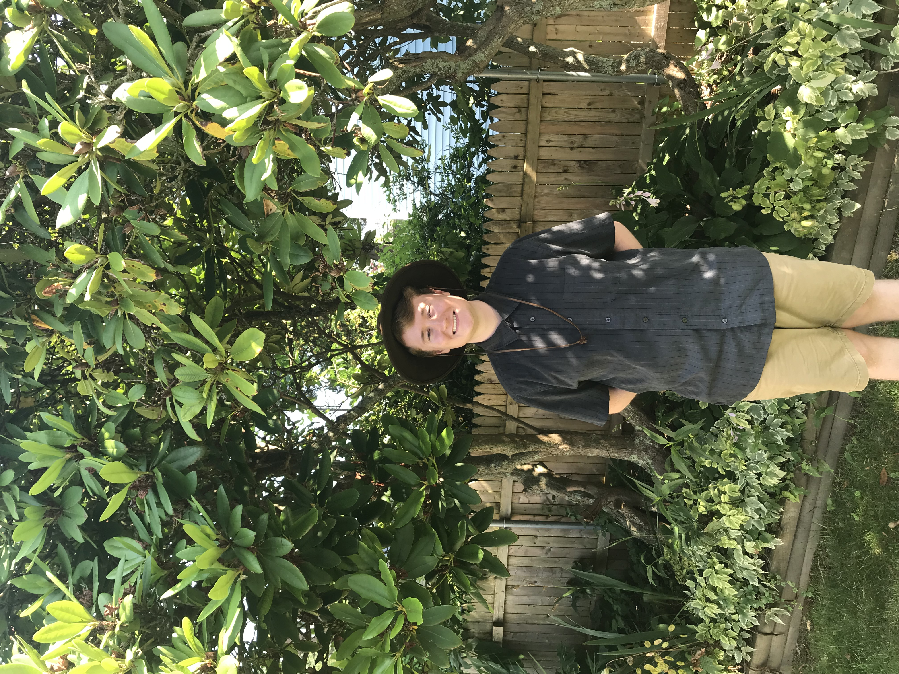

# Noah Manuel

Hello! My name is Noah Manuel. I'm a biologist and Masters Student in the EEB Department at the University of Connecticut! I'm originally from Newport, Rhode Island where my love of the natural world began by living by the sea!

I attended Saint Anslem College for my undergraduated studies in Manchester, New Hampshire where I majored in Biology and minored in Chemistry. While there I conducted a study, for my Senior Honors Thesis, where I collected over 130 different flowering plant specimens in order to create a flora for the College. I also sung tenor in the College Choir and worked as a Resident Assistant during my time on the Hilltop! In 2023, I graduated Suma Cum Laude from Saint Anselm with a Honors Bachelors of Science in Biology. 

After completing my Masters, I plan to obtain my PhD in order to become a professor of biology so I can teach students about the beauty of the natural world! 

{:width="200px"}

## Research Interests
1. Taxonomy and Phylogeny
2. Algae 
3. Plants and Herbarium creation
4. Microogranisms
5. More to Come!

## Fun and Interestings Facts
1. I love to collect board games! I have over 100 games in my collection
2. I love that State of Rhode Island!
3. Tea is my favorite hot drink and Moxie Soda is my favorite cold drink!
4. My favorite band is Tally Hall.
5. Moby Dick is the greatest book ever written!
   
