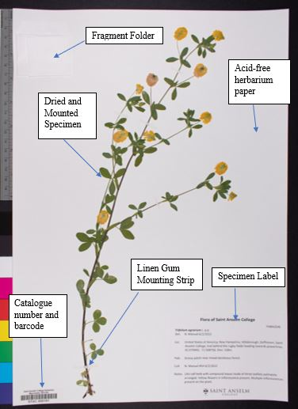
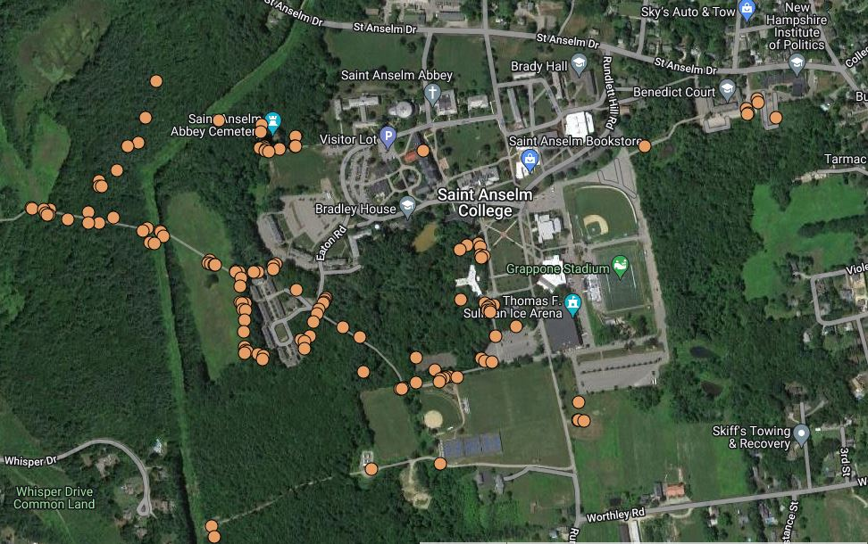

# Research Projects Past and Present

- 
 Creation of a Flora for Saint Anselm College 
 
   
Over 8 weeks of the summer of 2022, I identified, collected, and pressed 135 angiosperm specimens located within the natural areas owned by Saint Anselm College and Saint Anselm Abbey located in Manchester, New Hampshire. This project funded as part of the Honors Summer Research Fellowship.
   This was the first major flora created of the campus in almost 100 years. My project discoverd that over half of the flowering plants on campus were native to the area, while the other half was introduced to the area with a small percentage of invasive species present.
   All specimens collected were added to the Saint Anselm College Herbarium and digitized. All images are available on the Conssortium of Northeastern Herbarium website on the Saint Anselm College Page. 

- 
Masters Thesis Project Under Development! More to come soon!

